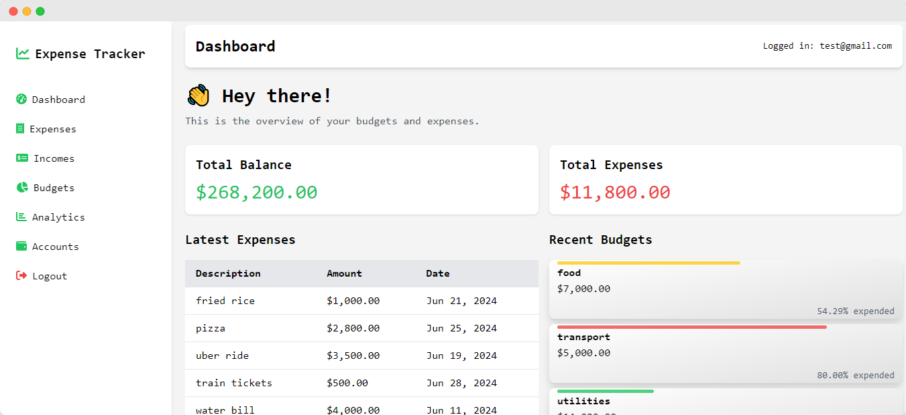
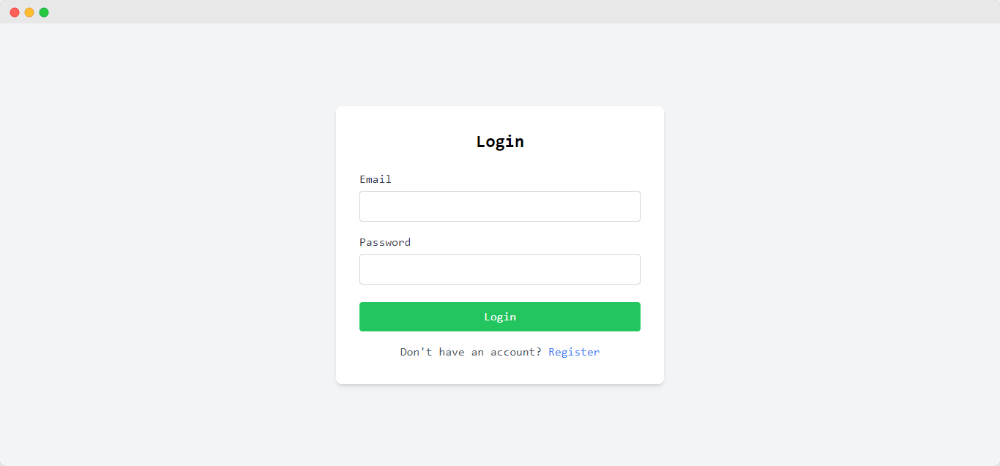
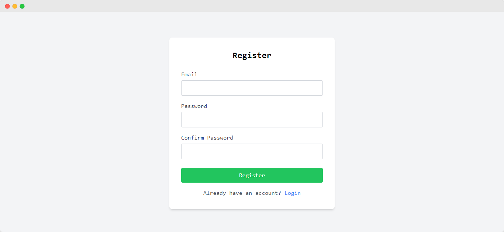
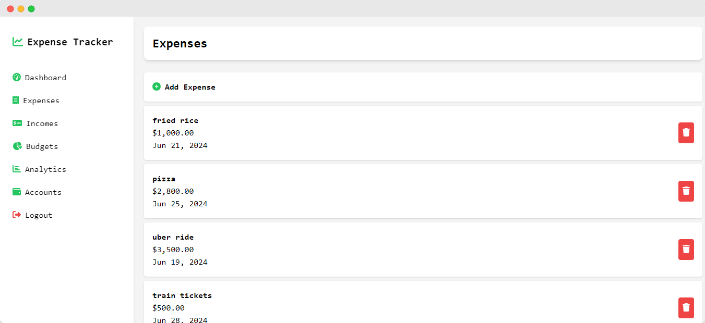
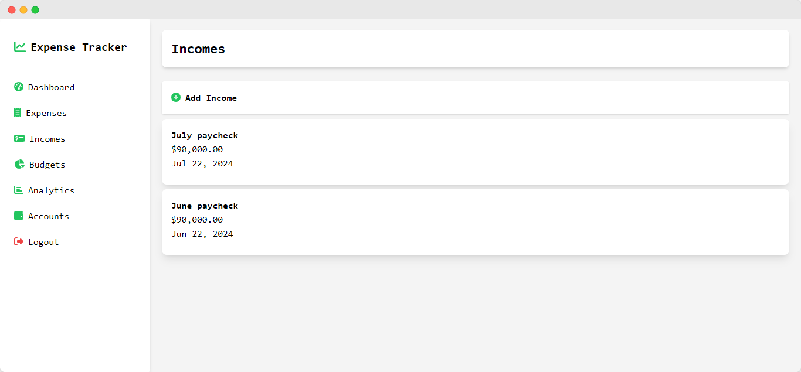
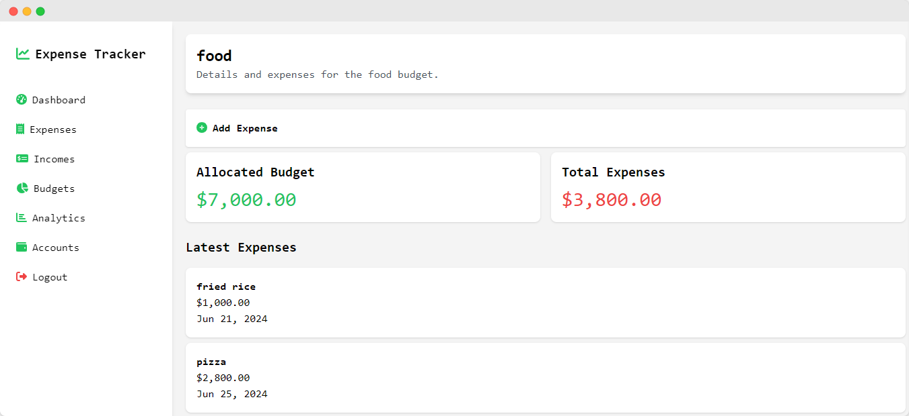
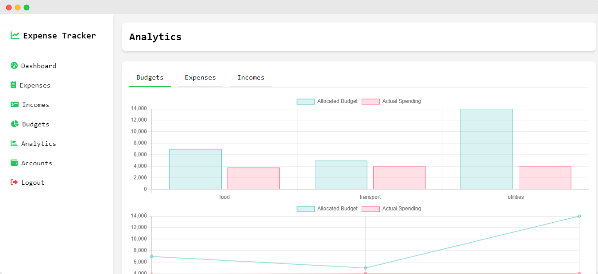
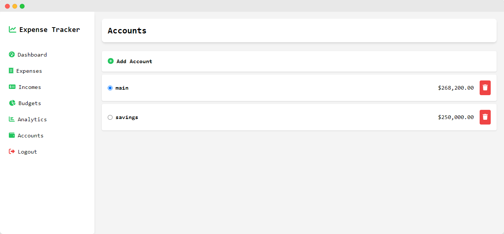

# Expense Tracker



## Overview

Expense Tracker is a full-featured web application for managing your personal finances. It allows users to track their incomes, expenses, and budgets, providing a comprehensive overview of their financial status. The application includes authentication features and ensures data is secure and accessible only to authenticated users.

## Features

- **Authentication**
  - User registration and login
  - Secure access to application features
- **Dashboard**
  - Overview of total balance and expenses
  - Latest expenses and budgets
- **Expense Management**
  - Add, edit, and delete expenses
  - Categorize expenses for better tracking
- **Income Management**
  - Add, edit, and delete incomes
  - Link incomes to specific accounts
- **Budget Management**
  - Create, edit, and delete budgets
  - Track budget expenditure with visual indicators
- **Analytics**
  - Visual representation of expenses and incomes
  - Detailed charts and graphs
- **Accounts**
  - Manage multiple accounts
  - Track expenses and incomes per account

## Technologies Used

### Frontend

- **Angular** - Framework for building client applications in HTML and TypeScript
- **Tailwind CSS** - Utility-first CSS framework
- **Font Awesome** - Icon library for adding icons and symbols

### Backend

- **.NET Core 8** - Framework for building web applications and services
- **Entity Framework Core** - ORM for data access
- **ASP.NET Core Identity** - Authentication and authorization framework

### Database

- **SQL Server** - Relational database management system

## Setup and Installation

1. **Clone the repository:**
   ```sh
   git clone https://github.com/YureshTharushika/Expense_Tracker_Frontend.git
   cd expense-tracker

2. **Install Dependencies**
    ```sh
   npm install

3. **Start the Development Server**
    ```sh
   ng serve

## Screenshots

### Dashboard


### Login


### Register


### Expenses


### Incomes


### Budgets


### Analytics


### Accounts


## Contributing

Contributions are welcome! Please create an issue first to discuss any major changes.

1. Fork the repository
2. Create your feature branch (`git checkout -b feature/AmazingFeature`)
3. Commit your changes (`git commit -m 'Add some AmazingFeature'`)
4. Push to the branch (`git push origin feature/AmazingFeature`)
5. Open a pull request
